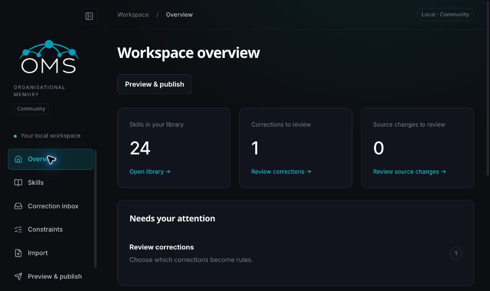
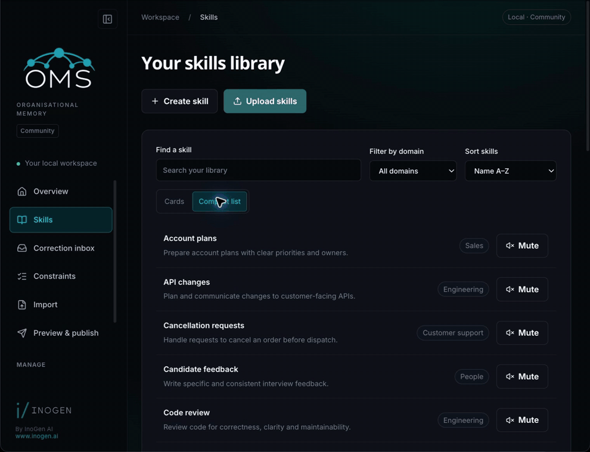
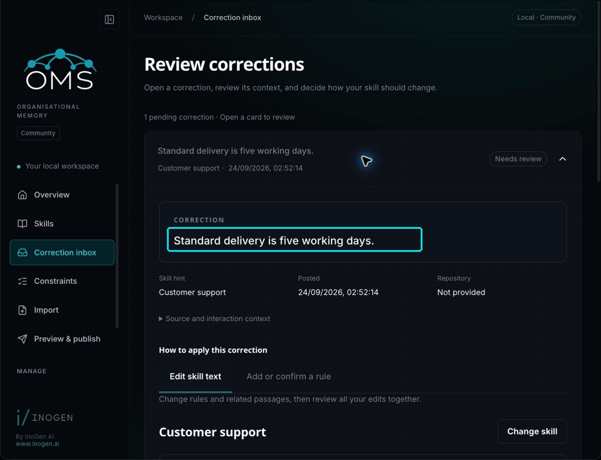
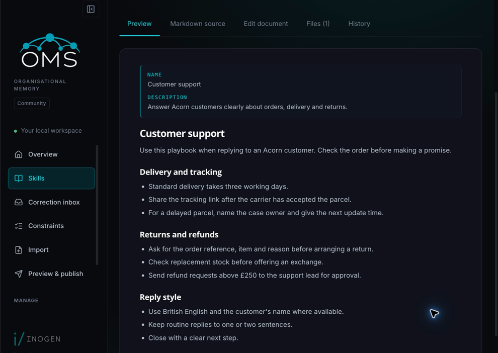
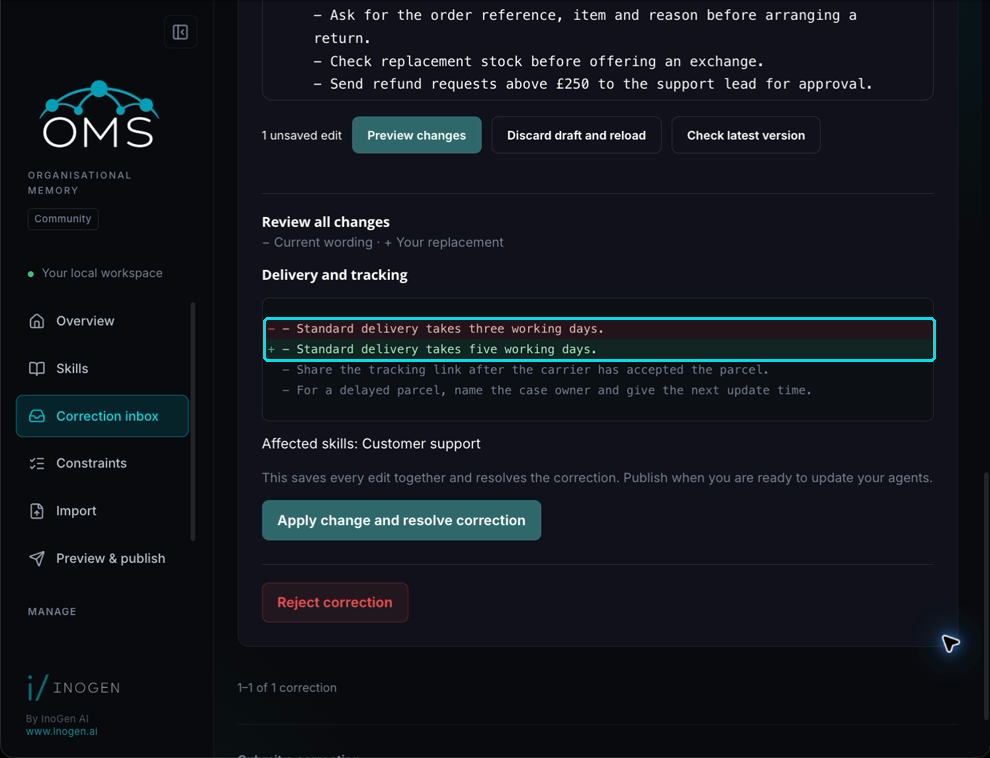

# OMS Community

OMS Community is a local workspace for the skills and rules your AI agents use.
Import guidance, inspect it, capture + review corrections and publish portable skill files that reach your agents across harnesses
on your own machine.

Corrections enter a manual inbox. You choose the skill, edit the durable wording
and decide whether to amend existing guidance, create a rule, reinforce an
existing rule, or reject it.



## See it in action

### Find the guidance your agents use

Filter a populated library by domain, open a skill and read its instructions.
This example narrows 24 skills to four in customer support.



[Watch the video version](docs/images/readme/find-your-guidance.mp4)

### Review a correction, then publish

A delivery policy changes from three to five working days. Edit the existing
text, check the before-and-after comparison, apply the change and publish.
The final view shows the updated `SKILL.md` on disk.



[Watch the video version](docs/images/readme/review-and-publish.mp4)

Community keeps these decisions manual. It does not generate revisions or apply
corrections automatically. Once you have connected your agents using the installer
below, they can use the published guidance; existing sessions may need reloading.

<details>
<summary>Inspect the skill and change preview as still images</summary>

A skill contains readable guidance, with its source, supporting files and history
available alongside it.



The change preview shows the original wording, your replacement and the affected
skill before you apply anything.



</details>

*Captured from OMS Community 1.2.0 using a fictional Acorn workspace. Recordings
are shortened and annotated for clarity.*

## Start locally

Install Docker with Docker Compose, then run this command from this repository:

```sh
./run-local.sh
```

To keep published skills in your home directory, choose a dedicated folder:

```sh
./run-local.sh --publish-dir "$HOME/.oms_skills"
```

The launcher remembers this folder and the Compose project in `.env.local`.
Later runs of `./run-local.sh` reuse them. `--publish-dir` accepts absolute paths,
relative paths beneath this checkout, and quoted `~/` paths. The existing
`OMS_PUBLISH_HOST_ROOT` environment override is also remembered.

Open <http://localhost:4318>. The API is at <http://localhost:4317>. Both host
ports bind to loopback; Neo4j has no exposed host port. The launcher creates a
random database password in `.env.local` with owner-only permissions. Keep that
file when restarting the stack, because the database keeps its password.

1. Upload `examples/starter` or your own skill tree as a folder or ZIP.
2. Submit a correction and open the correction inbox.
3. Select its skill, edit existing guidance or confirm new wording, and apply the decision.
4. Preview and publish the updated tree. Publication preserves imported
   references, scripts and other owned files.

Package folders identify the source of an imported skill. For example,
`agenthub/skills/run/SKILL.md` and `autoresearch-agent/skills/run/SKILL.md`
remain separate even if both declare `name: run`. Keep that folder layout when
re-importing updates. Renaming or moving a package creates a different source;
the importer does not guess that it should replace an existing skill. The
import result lists each source and its assigned skill ID.

Community needs no model key, paid package or licence service. Sanitisation and
deterministic injection screening run before a correction reaches the inbox.
A safety hold requires an explicit decision.

## Apply a correction to existing guidance

Corrections start as collapsed cards. Open one to see the full correction,
its skill hint, posting time and repository above the editing controls.
**Source and interaction context** shows the captured request and agent response
when available. Submitting another correction is a secondary action below the list.

Use the **Edit skill text** and **Add or confirm a rule** tabs to switch modes.
In **Edit skill text**, open a suggested skill or find it by name, then type
directly into its rules and passages. The **Markdown / Preview** toggle at the
top right switches between editing and a rendered view of the current draft.
**Find in skill** automatically centres the first occurrence; **Next match**
and **Previous match** navigate the rest without hiding surrounding text.
You can also select text and choose **Replace selection with correction**.
Clear a rule's text to remove it. The change preview labels it **Remove rule**;
applying retires the rule while preserving its wording and evidence for History
and restore. Shared rules still require confirmation of every affected skill.
If Apply is unavailable, the reason appears beside the button.

Change any passages that restate the old instruction, then choose **Preview
changes** once for all your edits. The change preview shows removed and
replacement text and every affected skill. Editing shared guidance requires
confirming all listed skills. **Apply change and resolve correction** saves
the edits, correction evidence and version history together. Publish when you
are ready to update your agents.

Drafts survive collapsing cards or switching corrections or modes while the
inbox stays open, and remain available after a failed save. They are not saved
across a page reload. If the skill changes while you are editing, the server
refuses the stale edit. Use **Check latest version**, copy any draft text you
need, then discard and reload to edit the latest wording. Saved changes can
be compared and restored from the skill's **History** tab.

In **Compare existing rules**, each match shows its skill, section and subheading,
with only the matched rule highlighted by default. **Show full section** reveals
the surrounding passage and other rules. Shared rules show their context in each skill. This
uses the current saved skill text; unsaved edits remain in **Edit skill text**.

For new guidance, choose **Add or confirm a rule**. A successfully matched skill
hint keeps **Target skills** collapsed; use **Change target skills** to adjust
it. Write the proposed rule, then use **Choose where to insert** and select
**Insert here** between the existing rules. The default adds it at the end of
the skill. Prose sections are amended through **Edit skill text**.

Each suggested existing rule has a **Replace this rule** action. Review the
before/after text, then choose **Replace rule and resolve correction** to
replace it in its current position. Choose **Edit this and related passages**
if the correction also affects other wording in the skill. **Keep this rule
and reinforce it** preserves the existing wording and requires confirmation
for a non-exact match. Unticking confirmation cannot create another rule.
To keep both instructions, choose **Choose a separate rule instead**, then
**Create separate rule**.

The skill's **Edit document** tab uses the same text editor for edits outside
the correction inbox. Individual edits can be undone without losing the rest
of your draft.

All selection and rewriting is manual. Community does not generate revisions
or decide whether two instructions have the same meaning.

Stop services while keeping their data:

```sh
docker compose --env-file .env.local down
```

The `graph` and `workspace` named volumes hold the database and file custody.
Removing volumes erases that data. Export or back them up before doing so.

## Connect your agents

Open **Preview & publish** and choose **Publish skills** (or **Publish and push**
for Git). After publication, **Install or reconnect agents** opens with the
command and a **Copy install command** button. You can reopen this section on
later visits without publishing again or changing your destination.

For a new destination, use **Settings → Set up publication**. The same wizard
is available from **Preview & publish**. It guides you through the destination,
preparation, publication and the one-time agent installation.

For a local folder, the launcher binds your chosen host folder into `/published`
in Docker. The default remains this repository's `published/` directory.
Choose **Change folder** on the publication card or in Settings to enter a
different host folder, such as `~/.oms_skills`. Run the copyable command on the
computer running Docker, then choose **Check folder connection**. The command
targets the same Compose project, retaining your workspace and database.
Docker needs to recreate the API container to change its mount; the browser
cannot move that mount itself.

Publish again after changing folders, then run the installer shown by the
wizard to reconnect your agents. Existing files stay in the old directory;
the launcher does not move or delete them. A deployment started with a custom
Docker configuration must update its own mount. Enter an optional subfolder in
Settings to keep separate bundles, or leave it empty. The same folder change
can be made directly from Terminal:

```sh
./run-local.sh --publish-dir "$HOME/.oms_skills"
```

The folder is remembered for subsequent starts. On native Linux, a one-time
container step grants the API's uid `10001` write access to
this directory using a filesystem ACL. It does not change the host owner or
grant write access to other users; the API itself stays unprivileged. Use a
local filesystem with POSIX ACL support. Docker Desktop on macOS handles the
bind-mount permissions for the host user without this step.

Publish, then run the exact `sh .../install.sh` command shown under
**Install or reconnect agents** (or the wizard's **Install** step) on
the computer where your agents run. The installer links the supported agents
to the bundle and checks for completed local publications every minute using
launchd on macOS or cron on Linux. It adds and removes skill links and updates
copied instructions; no Git repository is required. The final installer message
confirms scheduling or explains how to refresh manually. Keep the bundle in
place. Existing agent sessions may need to be reloaded. Cursor's global User
Rules still require pasting the staged text shown by the installer.

For GitHub, create a dedicated repository, enter its HTTPS clone URL and branch,
then choose **Save and continue**. The **Git access** step gives you:

1. A GitHub token-creation link with the repository owner and write permission
   prefilled. Choose **Only select repositories**, select your skills repository,
   and check **Contents: Read and write**. Choose an expiration and generate the
   token. Organisation repositories may require approval before it can publish.
2. A copyable command targeting the exact Docker API container serving the page.
   Run it in Terminal on the computer running Docker; no directory change or
   Compose project selection is needed. Enter your personal Git username, then
   paste the token at the hidden prompt. Never paste it into the repository URL.
3. A read-access result. An empty repository can pass, and a public repository
   can pass without valid credentials. Continue to **Publish and push** to create
   the bundle; pushing a new commit verifies write access.

The command is `oms git-login --repository <HTTPS-URL>` inside the API container.
Outside Docker, run it as the server's operating-system user in its Python
environment. Add `--check` to check existing Git access without saving a token.
The wizard also supports an existing SSH setup; GitHub SSH users can choose
**Use guided HTTPS setup** to switch to these instructions.

Tokens are stored **unencrypted**, in files readable only by the server account,
inside `/home/oms/.oms-git` in Docker's persistent `git-config` volume. Git config
selects a separate credential file for each repository. Tokens never enter browser
settings, the graph or the published bundle. Repeat the login command to rotate
an expired token; revoke an old token on GitHub to invalidate it. Removing the
volume also removes saved Git configuration and credentials. Treat this volume
as private when backing up the workspace. See GitHub's
[token instructions](https://docs.github.com/en/authentication/keeping-your-account-and-data-secure/managing-your-personal-access-tokens)
and Git's [credential storage documentation](https://git-scm.com/docs/git-credential-store).

After publication, **Install** handles the separate connection from each agent's
computer. Public HTTPS repositories need no login. For a private repository,
check the computer's existing Git access, then use the supplied GitHub CLI login
commands or its credential manager if needed. A separate reader token only needs
**Contents: Read-only**; do not distribute the publisher's write token.

The wizard supplies a repository-specific clone destination and stops before
installation if cloning fails. If you already have a checkout, use its existing
`install.sh`. Git installations refresh every three hours; run `sh ~/.oms/oms-refresh.sh`
for an immediate update.

### Where agents send corrections back

A published bundle carries the contribution instruction, the bundled
`oms_contribute.py` helper and `.mcp.json`, all built from one setting:
`OMS_PUBLIC_URL`, the address this server is reachable on. Leave it unset for a
single machine and the bundle names `http://localhost:4317`, the address the
launcher already serves on. Set it when the server and the agents are on
different computers:

```sh
OMS_PUBLIC_URL=https://oms.example.org ./run-local.sh
```

That sets the address for one start. To keep it, add the same line to
`.env.local` beside the database password; the launcher passes that file to
Docker Compose on every start.

Set it to an empty string to publish read-only bundles: no contribution
instruction, no helper, no MCP configuration.

Publishing to a Git repository is refused while the address is a loopback
address such as `localhost` or `127.0.0.1`, whether it came from the default or
you typed it. A repository is cloned onto other computers, and there a loopback
address points every correction at the reader's own machine, where nothing is
listening. The **Set up publication** wizard shows the advertised address and
this warning as soon as you choose a Git repository, before any token work.
Local folder publication is unaffected, and so is `oms publish --git-url
--dry-run`, which pushes nothing.

## Run on a server

The launcher is built for one computer: the server, the browser and the agents
all on the same machine, with every host port bound to loopback. You can run
the same stack on a server that agents on other computers reach, but read this
first.

**Community has no login.** Anyone who can reach the address can read every
skill, post corrections, change settings and publish. Securing access is your
job in this edition: a VPN, an IP allow list, or an authenticating reverse
proxy in front of the stack. Pro and Enterprise are built for shared access,
with identity, team scoping and publication approval; see
[LICENSING.md](LICENSING.md), which also covers hosting OMS for other
organisations.

Three settings change. All three are read by the API container:

| Setting | What it does |
| --- | --- |
| `OMS_PUBLIC_URL` | The address published bundles tell agents to call. Git publication is refused while it is loopback. |
| `OMS_ALLOWED_HOSTS` | Host names the API accepts in the `Host` header, names only, no port. Any other name gets `400`. |
| `OMS_ALLOWED_ORIGINS` | Exact browser origins that may make changes: scheme, host and port. Any other origin gets `403`. |

`compose.yaml` fixes `OMS_ALLOWED_ORIGINS` to localhost and does not forward
`OMS_ALLOWED_HOSTS`, so `.env.local` cannot set them. Put all three in a
`compose.override.yaml` beside `compose.yaml`; Docker Compose loads it with the
launcher's own file on every start:

```yaml
services:
  api:
    environment:
      OMS_PUBLIC_URL: https://oms.example.org
      OMS_ALLOWED_HOSTS: oms.example.org
      OMS_ALLOWED_ORIGINS: https://oms.example.org
```

`OMS_ACKNOWLEDGE_NETWORK_EXPOSURE` is already `1` in `compose.yaml`. It only
records that you accept the exposure; it adds no protection.

Leave the host ports on loopback. Run a TLS reverse proxy on the same server
and point it at `127.0.0.1:4318`. The UI container already forwards `/api/` and
`/mcp` to the API, so the proxy needs one upstream, and ports 4317 and Neo4j
stay closed. The proxy must pass the original `Host` header through, or the
API answers `untrusted HTTP host`, and it must accept request bodies of 25 MB
for skill uploads. Then start the stack as usual:

```sh
./run-local.sh
```

Check it: open the public address, choose **Set up publication**, pick **A Git
repository** and confirm the Destination step shows the public address with no
loopback warning. After a publication, the bundle's `oms_contribute.py` and
`.mcp.json` name `https://oms.example.org/api/ingest` and
`https://oms.example.org/mcp`, and each agent computer's installer needs no
change.

## Python development

```sh
uv sync --frozen --extra test
uv run oms --help
uv run pytest tests
```

The database tests support `OMS_TEST_NEO4J_URI`, `OMS_TEST_NEO4J_PASSWORD` and
`OMS_TEST_NEO4J_DISPOSABLE=1`. They erase the test graph; provide only an isolated
test database. With no explicit URI, they launch their own test container.

The static frontend and reusable public packages live under `frontend/`.

To publish manually to an existing Git repository, preview the operation first:

```sh
uv run oms publish --git-url https://example.org/your/skills.git --branch main --dry-run
```

Run it again without `--dry-run` to push. The generated checkout lives in
`.oms/git-publication` by default, beneath the configured data directory in
Docker. Supply repository access through your local Git configuration; Community
does not enrol a person or obtain a managed publishing credential.

See [architecture](docs/architecture.md), [deterministic reference tests](docs/reference-tests.md),
[release validation](docs/releasing.md), [security](SECURITY.md),
[contribution policy and context](docs/contribution-policy-and-context.md) and
[licensing](LICENSING.md) before distributing this candidate.

## Licence

OMS Community is source-available under the Sustainable Use License, Version 1.0
(SUL-1.0). You may use it for your organisation's internal work and for personal
or non-commercial use. Selling it, putting it into another product or service, or
hosting it for other organisations needs a commercial licence from
INOGEN AI UK LTD (<info@inogen.ai>). See [LICENSING.md](LICENSING.md).
Contributions need the [Contributor Licence Agreement](CLA.md).
