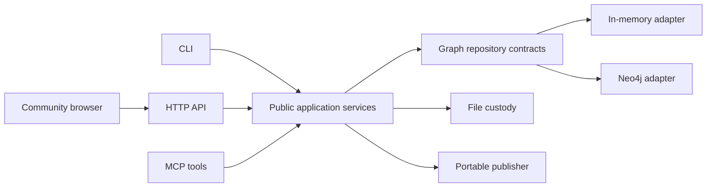

# Community architecture

The public `oms-core` Python package owns skill custody, the local manual
workflow and portable publication. The `oms` CLI, HTTP API and MCP server
compose the same services. The browser application uses the public API client
and neutral UI components under `frontend/packages/`.

Imports retain original source files and their digests. Structured rules,
prose, references and source provenance are stored separately, so an operator
can inspect a source change before accepting it. Referenced scripts remain
files under custody; importing them does not execute them.

Correction capture sanitises the input and performs deterministic injection
screening. The manual workflow then records an explicit create, reinforce,
amend or reject decision. Amendments address existing rule or prose parts by
anchor and checked document revision. Shared-rule edits require the exact set
of affected skills. New rules can be placed in a selected rule section and
position. A committed decision links its transaction,
rule, selected skills and history version. Conflicting retries fail without
partially applying another decision. Safety holds remain visible for review.

The graph interfaces expose the operations each service needs: ingestion,
custody, catalogue, publication and history. The in-memory and Neo4j adapters
implement those contracts. Neo4j stores edition ownership and schema metadata
and runs migrations transactionally. The default workspace is `acme`.

Publication reads active rules through an explicit single-workspace policy,
renders the portable tree and preserves owned reference and script bytes.
Local publication and an explicitly requested Git publication share that
renderer. Git credentials come from the operator's Git environment.

The private product consumes this exact public wheel and the two public npm
packages. Its composition supplies private model processing, identity,
organisation policy and managed publication through public interfaces. Public
source contains no import of that private implementation. The release gate
checks this direction in source, dependency metadata and built archives, and
tests Community in an environment containing only the public wheel.

See [deterministic reference tests](reference-tests.md) for the measurable
contracts and [release validation](releasing.md) for the artefact boundary.
